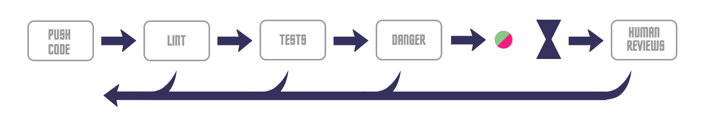
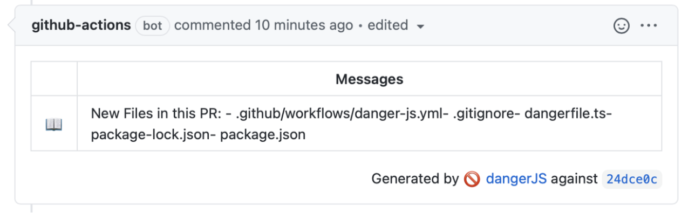

# Automating pull request feedback

Sourav Sarkar
Apr 2021

---

## Automating pull request feedback

### Why?

- When you raise a pull request, the faster you receive the feedback, the quicker it can be resolved
- Codify teams’ best practices. It can reduce the number of cases where code does not follow best practices gets missed during normal review

### How?

- Use Danger


---

### What is Danger

- Danger runs during your CI process and gives teams the chance to automate common code review chores.
- This provides another logical step in your build, through this Danger can help lint your rote tasks in daily code review.
- You can use Danger to codify your teams' norms. Leaving developers to think about harder problems.
- Leaving messages inside your PRs based on rules that you create with JS/Ruby, Swift/Python/Kotlin



---

### What does it look like?

Incomplete package upgrades


---

### What does it look like?

Notify about new files



---

### What does it look like?

Encourage smaller PRs


---

### What does it look like?

Ensure nice, tidy commit messages and not something like - “made some changes” (~1k commit results)


--- 

### Danger in action


--- 

### What it used to be


~ 17851 more lines to go

---

### What else can I do?


- Enforce changelogs
- Keep Lockfile up to date
- Ensure PRs have assignees
- Look out for common anti-patterns
- Encourage more testing
- Highlight documentation updates
- Show useful info on a PR
- Highlight SemVer breakages
- Anything you can think of ...

---


### Custom Rules

```js

const checkPRSize = () => {
  if (
    danger.github.pr.additions + danger.github.pr.deletions >
    BIG_PR_THRESHOLD
  ) {
    warn(`:exclamation: Big PR; over ${BIG_PR_THRESHOLD} changes :sob:`);
    markdown(
      '> Pull Request size seems relatively large. If Pull Request contains multiple changes, split each into separate PR will helps faster, easier review.',
    );
  }
};

```

---

### How can I add Danger to my project?

- Install Danger
- Codify rules in Dangerfile with danger DSL
- Add post build script in Jenkins


---

### Dangerfile in the wild


---

### More Examples


[Examples on Github](https://github.com/search?q=path%3A**%2Fdangerfile.js&type=code&ref=advsearch)


---

### Thank You


