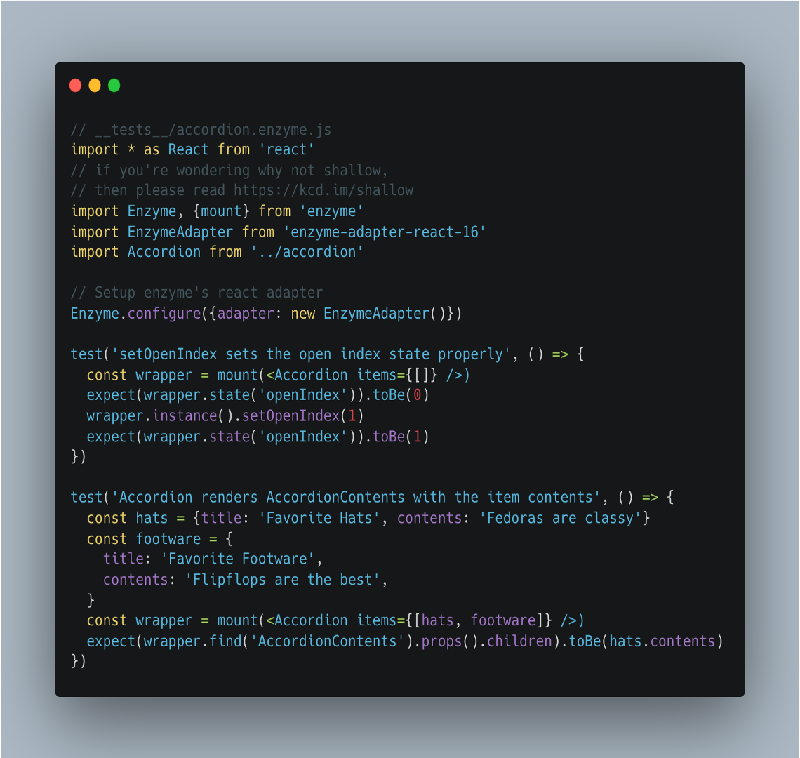
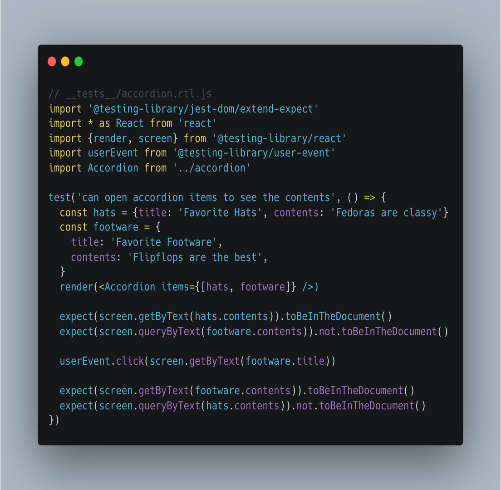
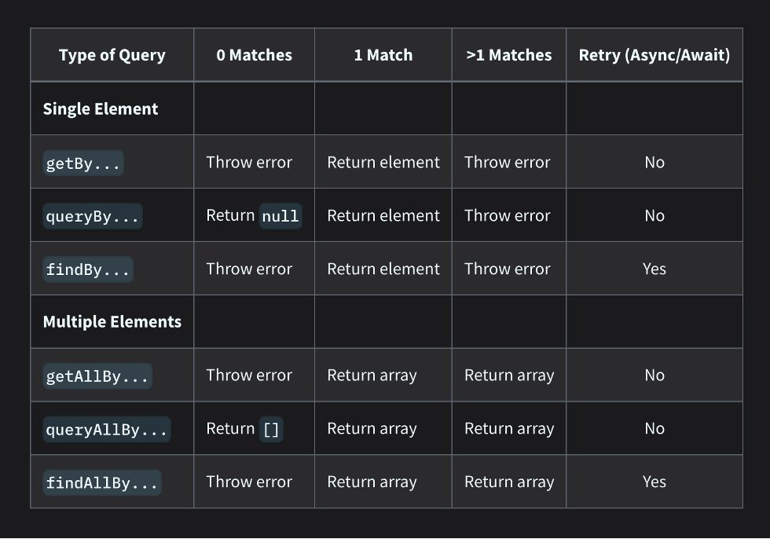
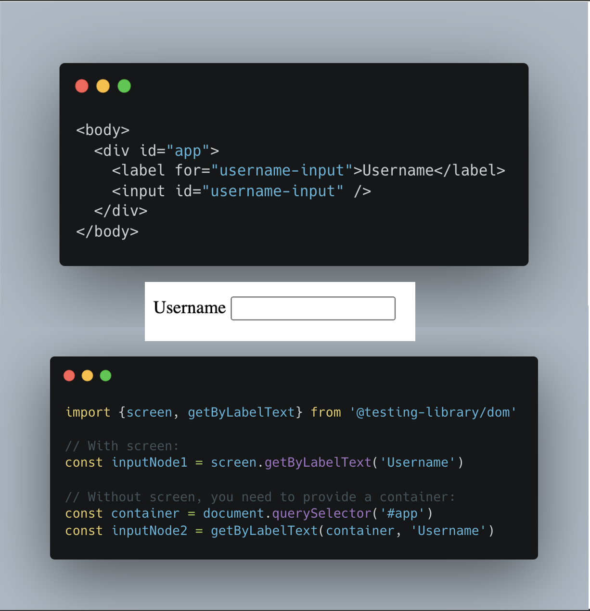
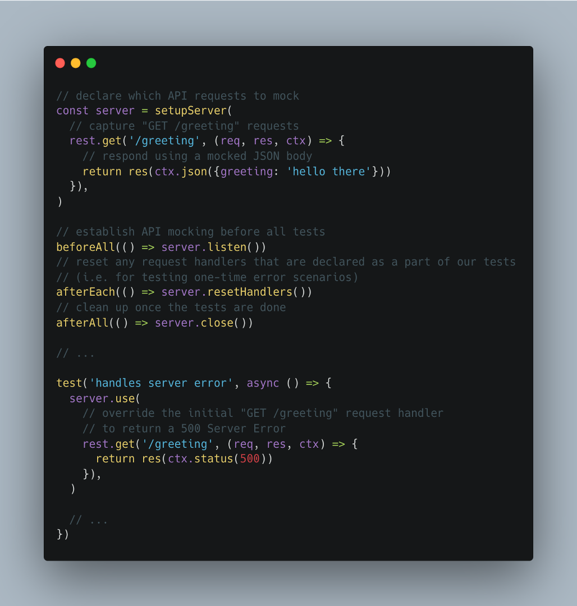

# Testing Library and MSW

Sourav Sarkar
Sep 2022

---

### Testing Library

#### What?

Set of utilities that encourage good testing practices

#### Why?

- Tests only break when your app breaks, not implementation details
- Interact with your app the same way as your users
- Built-in selectors find elements the way users do to help you write inclusive code
- ** No official support by enzyme for React > 16
- ** Hooks support not great with enzyme

    - Change in implementation details has a big impact on tests, big bummer if you refactor class based implementation to hooks based functional component. Tests will not help to figure out if the refactor broke the component

---

### The Solution

The Testing Library family of libraries is a very light-weight solution for testing without all the implementation details like – 

- Internal state of a component
- Internal methods of a component
- Lifecycle methods of a component
- Child components

The main utilities it provides involve querying for nodes similarly to how users would find them. In this way, testing-library helps ensure your tests give you confidence in your UI code.

---

### Guiding Principle

> “The more your tests resemble the way your software is used, the more confidence they can give you.”

---

# An Enzyme test

--- 

# A RTL test

---

# The API

### Queries

- Methods that testing-library gives us to find elements on the page
- Several types of queries available like (get*, find* and query*)

### User Actions

- Fire events with `fireEvent` or `user-event` library
- Async: `waitFor` and `waitForElementToBeRemoved`

### Debugging

- `screen.logTestingPlaygroundURL()`

---

# Queries

---

# Query Priority

- Based on the guiding principle our test should resemble how users interact with it 
- Order of priority - 

    - Queries Accessible to Everyone: Queries that reflect the experience of visual/mouse users as well as those that use assistive technology.
    
        - getByRole: This can be used to query every element that is exposed in the accessibility tree. With the name option you can filter the returned elements by their accessible name. This should be your top preference for just about everything. There's not much you can't get with this (if you can't, it's possible your UI is inaccessible). Most often, this will be used with the name option like so: getByRole('button', {name: /submit/i}).

---

# Query Priority (cont...)

- getByLabelText: This method is really good for form fields. When navigating through a website form, users find elements using label text. This method emulates that behavior, so it should be your top preference.
- getByPlaceholderText: A placeholder is not a substitute for a label. But if that's all you have, then it's better than alternatives.
- getByText: Outside of forms, text content is the main way users find elements. This method can be used to find non-interactive elements (like divs, spans, and paragraphs).
- getByDisplayValue: The current value of a form element can be useful when navigating a page with filled-in values.

--- 

# Query Priority (cont...)

- Semantic Queries HTML5 and ARIA compliant selectors. Note that the user experience of interacting with these attributes varies greatly across browsers and assistive technology.

    - getByAltText: If your element is one which supports alt text (img, area, input, and any custom element), then you can use this to find that element.
    - getByTitle: The title attribute is not consistently read by screenreaders, and is not visible by default for sighted users

- Test IDs

    - getByTestId: The user cannot see (or hear) these, so this is only recommended for cases where you can't match by role or text or it doesn't make sense.

--- 

# Usage

---

# MSW

- Component needs data
- Testing-Library recommends using Mock Service Worker library to declaratively mock API communication in your tests instead of stubbing window.fetch, or relying on third-party adapters.

---

# MSW Example

--- 

# Demo

---

